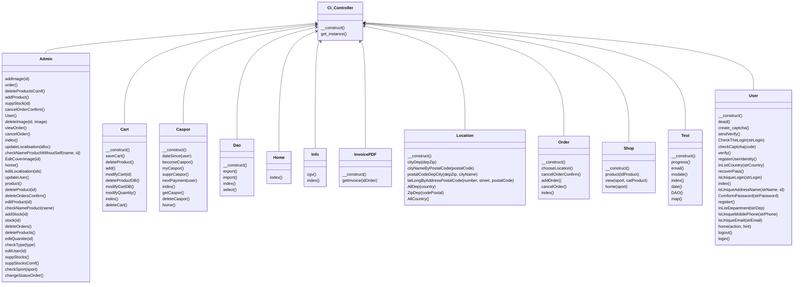

```mermaid
classDiagram
   direction BT
   class Admin {
      addImage(id) 
      order() 
      deleteProductsComf() 
      addProduct() 
      suppStock(id) 
      cancelOrderConfirm() 
      User() 
      deleteImage(id, image) 
      viewOrder() 
      cancelOrder() 
      index() 
      updateLocalisation(idloc) 
      checkNameProductWithoutSelf(name, id) 
      EditCoverImage(id) 
      home() 
      editLocalisation(ids) 
      updateUser() 
      product() 
      deleteProduct(id) 
      deleteOrdersConfirm() 
      editProduct(id) 
      checkNameProduct(name) 
      addStock(id) 
      stock(id) 
      deleteOrders() 
      deleteProducts() 
      editQuantite(id) 
      checkType(type) 
      editUser(id) 
      suppStocks() 
      suppStocksComf() 
      checkSport(sport) 
      changeStatusOrder() 
   }
   class CI_Controller {
      __construct() 
      get_instance() 
   }
   class Cart {
      __construct() 
      saveCart() 
      deleteProduct() 
      add() 
      modifyCart(id) 
      deleteProductDB() 
      modifyCartDB() 
      modifyQuantity() 
      index() 
      deleteCart() 
   }
   class Caspor {
      __construct() 
      dateSince(user) 
      becomeCaspor() 
      myCaspor() 
      supprCaspor() 
      nextPayment(user) 
      index() 
      getCaspor() 
      deleteCaspor() 
      home() 
   }
   class Dao {
      __construct() 
      export() 
      import() 
      index() 
      select() 
   }
   class Home {
      index() 
   }
   class Info {
      cgv() 
      index() 
   }
   class InvoicePDF {
      __construct() 
      getInvoice(idOrder) 
   }
   class Location {
      __construct() 
      cityDep(depZip) 
      cityNameByPostalCode(postalCode) 
      postalCodeDepCity(depZip, cityName) 
      latLongByAddressPostalCode(number, street, postalCode) 
      AllDep(country) 
      ZipDep(codePostal) 
      AllCountry() 
   }
   class Order {
      __construct() 
      chooseLocation() 
      cancelOrderConfirm() 
      addOrder() 
      cancelOrder() 
      index() 
   }
   class Shop {
      __construct() 
      product(idProduct) 
      view(sport, catProduct) 
      home(sport) 
   }
   class Test {
      __construct() 
      progress() 
      email() 
      modale() 
      index() 
      date() 
      DAO() 
      map() 
   }
   class User {
      __construct() 
      dead() 
      create_captcha() 
      sendVerify() 
      CheckTheLogin(strLogin) 
      checkCaptcha(code) 
      verify() 
      registerUserIdentity() 
      InListCountry(strCountry) 
      recoverPass() 
      IsUniqueLogin(strLogin) 
      index() 
      IsUniqueAddressName(strName, id) 
      ComformPassword(strPassword) 
      register() 
      InListDepartment(strDep) 
      IsUniqueMobilePhone(strPhone) 
      IsUniqueEmail(strEmail) 
      home(action, hint) 
      logout() 
      login() 
   }

   Admin  -->  CI_Controller 
   Cart  -->  CI_Controller 
   Caspor  -->  CI_Controller 
   Dao  -->  CI_Controller 
   Home  -->  CI_Controller 
   Info  -->  CI_Controller 
   InvoicePDF  -->  CI_Controller 
   Location  -->  CI_Controller 
   Order  -->  CI_Controller 
   Shop  -->  CI_Controller 
   Test  -->  CI_Controller 
   User  -->  CI_Controller 

```
