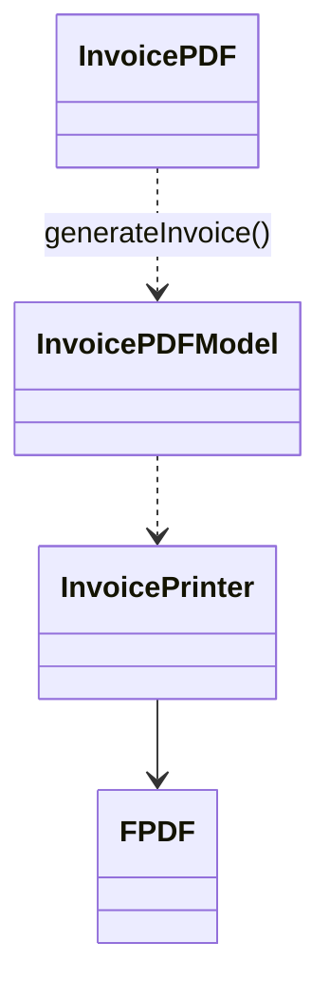

# Designs patern Utilisé dans le projet : 

## 1 : Le design patern Facade 

### Ou ? :

Dans la classe InvoicePDFModel.

### Pourquoi ? :

Car cette classe permet de simplifié l'utilisation de la classe PDFInvoice qui nous permet
de créer une facture. Pour ce faire cette classe demande juste l'id d'une commande, l'objet 
utilisateurs a qui correspond cette commande, et l'objet de base de la facture. Ensuite 
cette classe prend en charge de trouver la commande et de généré la facture aproprié.

## 2 : Le design patern DAO

### Pourquoi ? :
Nous avons choisi le design pattern DAO pour pouvoir aisément importé ou exporté différentes masses données dans les différentes tables voulues. 

### Comment ? :
La mise en oeuvre de ce design pattern ce fait via une interface en premier lieu où l'on a définit les principales méthodes à utiliser dans les différents models DAO (dao_json, dao_csv, dao_xml, dao_yaml). Vient ensuite le controller DAO où l'on choisit le model à utiliser en fonction de l'extension donnée par l'utilisateur. Le controller gère également les requêtes d'import ou d'export des données de l'utilisateur. Pour finir les différents modeles implémentent l'interface DAO c'est à dire les méthodes addData et getData. Ces 2 méthodes utilisent des packages avec des procédures pour pouvoir communiquer avec la base de donnée, les procédures et les packages changent en fonction de la table utilisé.

## 3 : Le design patern Stratégie