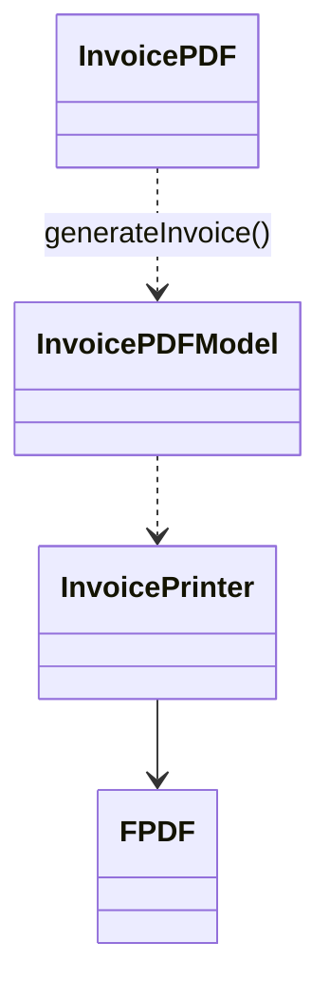

# Designs patern Utilisé dans le projet :

## 1 : Le design patern Facade

### Ou ? :

Dans la classe InvoicePDFModel.

### Pourquoi ? :

Car cette classe permet de simplifié l'utilisation de la classe PDFInvoice qui nous permet
de créer une facture. Pour ce faire cette classe demande juste l'id d'une commande, l'objet 
utilisateurs a qui correspond cette commande, et l'objet de base de la facture. Ensuite 
cette classe prend en charge de trouver la commande et de généré la facture aproprié.

On a donc bien InvoicePDF qui utilise InvoicePDFModel pour simplifié la génération des facture, InvoicePDFModel se chargant de l'utilisation de InvoicePrinter.
