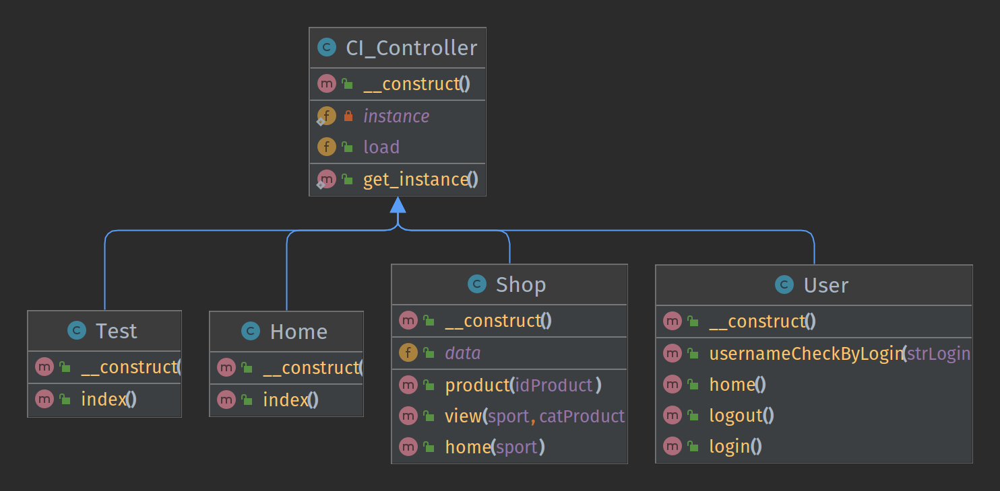
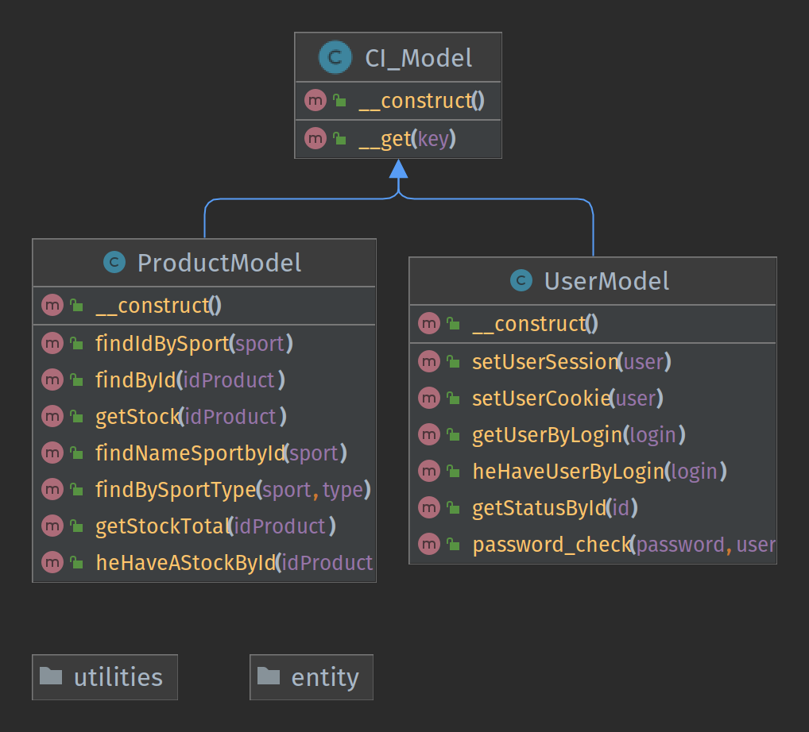
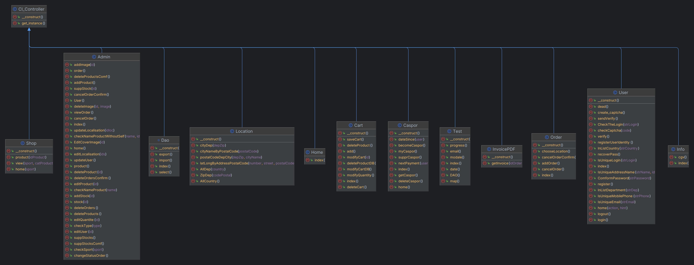
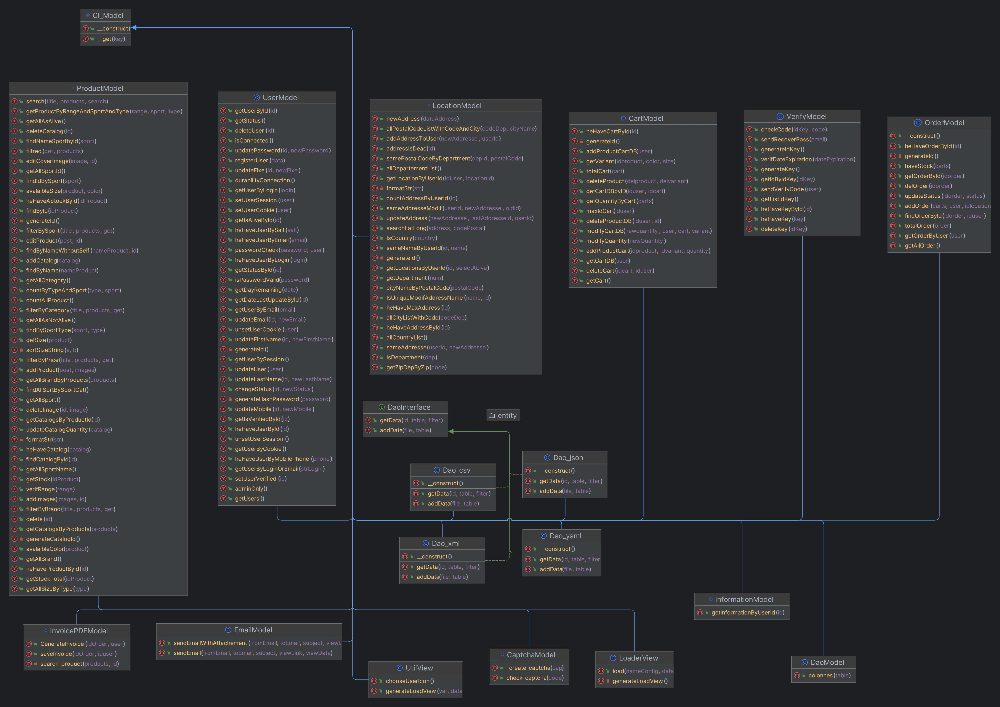
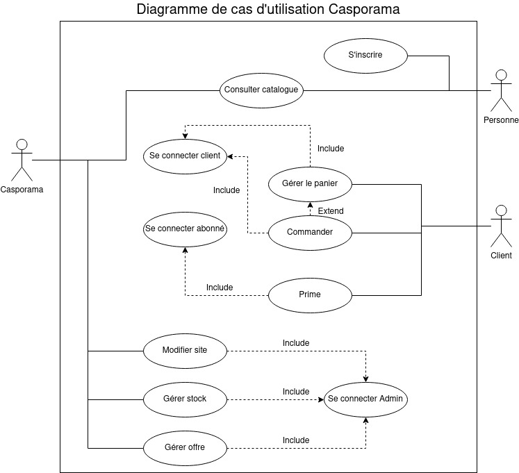
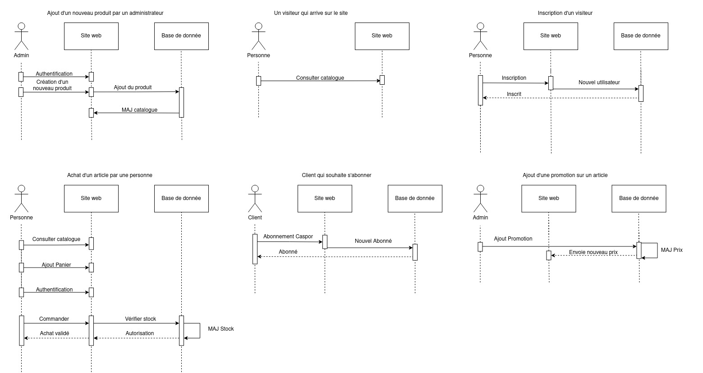
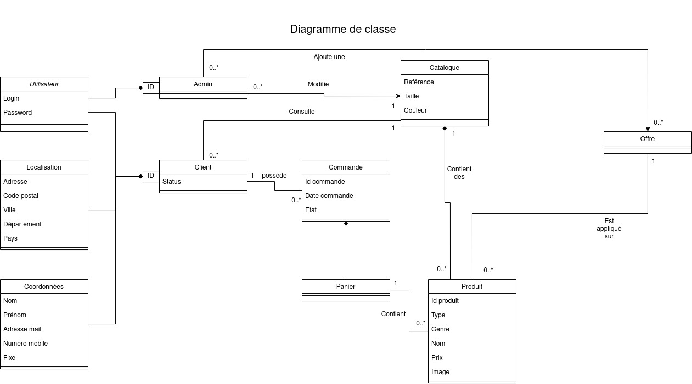

# SAE - Analyse

## 1 - Approche

### 1.1 Présentation de l'équipe :

Notre équipe est composé de 4 membre : Titouan Gautier, Arthur Hamelin, Maxime Santos Pereira et Luna Manson. Nous étions 5 au début mais Maxime Franco à quitté la formation.

Tout d'abord, Maxime Franco à immaginé et réalisé le premier jet de nos diagrammes d'Analyse. Il a fait une première version de du digramme de cas d'utilisations, de classes d'analyses ainsi que les différents scénarios.

Maxime Franco ayant quitté la formation et donc le groupe, le reste de l'équipe c'est chargé de la suite. Maxime Santos Pereira à amélioré le digramme de séquence afin qu'il soit plus complet et qu'il représente mieux ce qu'on à réalisé. Arthur Hamelin c'est chargé d'amélioré le diagramme de cas d'utilisations et Titouan Gautier c'est occupé des scénario.

### 1.2 Démarche de développement suivie

Nous avons utilisé une démarche de développement incrémental. Nous avons developpé chaque fonctionnalité une par une. Nous avons commencé par les controller Home, Shop puis User ainsi que les modèles de Produits et de User. Voici des images datant du 26/10/2022 avec les quelques avancement.

- Les Controllers

- Les Models

Ensuite nous avons continué ces controllers. Puis Nous avons implémenté un par un les controller Info, Admin, Cart, Caspor, Order et InvoicePDF , ainsi que leurs modeles. Voici des images montrantnotre avancé le 10/01/2023

- Les Controllers

- Les Models

Tout cela pour dire que notre approche à été incrémental car nous nous sommes concentre sur la livraison de version successives de produit qui incluent un nombre croissant de fonctionnalités.

### 1.3 Démarche suivie pour identifier, collecter et formaliser les besoins du client

Tout d'abord nous avons réfléchi aux besoins primaires qu'un client à sur un site de e-commerce. C'est à dire consulter les produits, ajouter au panier, se créer un compte etc. Ensuite nous avons présenter les ces besoins au professeur pour lui demander si nous les avions bien penser. Nous avons aussi regardé sur des sites de e-commerce. Comme notre projet est un site de vente de produit de sport, nous avons beaucoup consultés le site de Go Sport ainsi que le sites de Décathlon. Grâce à ces recherches, nous avons pu précisez et détaillés les besoins du clients.

### 1.4 Besoins non-fonctionnels identifiés

Pour les besoins non fonctionnel du client, nous avons pensées à la sécurité de ces informations en utilisant que des méthodes pour éviter que la base de donnés soit pirater. Nous avons aussi penser à la simplicité d'utilisations en partirionnant un maximum les différent partie du site.

## 2 - Diagramme de cas d'utilisations et scénarios

- Diagramme de cas d'utilisations

- Scénarios

## 3 - Diagramme de classe d'analyse

