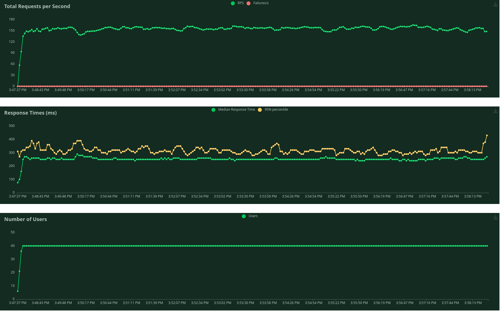

# Developpement efficace - SAE

## 1 - Mise en place de méthodes pour montrer que l’application est correcte

Casporama est un site de e-commerce divisé en 4 sport distinct : Football, Volleyball, Badminton et Arts-Martiaux. Pour chaque sport nous avons 3 catégories différentes contenant des produits : Vêtement, Chaussure et Equipement. Cette répartition des produits permet d'éviter un appel à la base de donnée pour un grand nombre de produit puisqu'ils sont triés par sport et par type. Pour continuer, l'utilisateur peut ajouter des produits à son panier pour ensuite soit l'enregistrer ou bien le payer directement. Lors du paiement une vérification du stock est réalisé. 

Pour continuer les pages ont été réalisées de telle sorte que les entités requisent contienne uniquement le contenu requis pour la page demandée par exemple dans le panneau d'admin, gestion d'utilisateur on n'utilise pas les entitées location, coordonnée qui sont présent dans l'entité user, donc pour éviter d'utiliser trop de requête vers la base de donnée on définit l'entité user sans adresses et avec uniquement son nom, prénom qui provienne de l'entité coordonnée. 

De plus, la base de donnée est sous 3 ème forme normalisé permettant ainsi d'éviter la redondance des données présentes dans les différentes tables, aucune forme de dépendance entre les colonnes n'existe. De plus toutes les tables sont reliées sauf captcha qui ne contient aucune clé étrangère et stock_alerte qui sert uniquement pour lister les produits ayant une rupture de stock, cela est une solution temporaire.

Voyons maintenant quelques algorithme réalisé pour des demandes plus spécifique


### 1.1 - Algorithme de filtre par prix

Cette algorithme permet de trier une liste de produit par prix avec un prix minimum et un prix maximum.

- Précondition : $products > 1$, $get > 1$

```

public function filterByPrice(string $title, array $products, array $get) : array
    {
    
        if (!empty($get['price']) && stristr($get['price'], '-')) {

            $price = $get['price'];

            $listPrice = explode('-', $price);

            $title .= " Prix -> " . $listPrice[0] . "€ - " . $listPrice[1] . "€, ";

            // * Initialisation du tableau de retour
            $listProductByPrice = array();

            // * On parcours le tableau de produit

            foreach ($products as &$product) {

                if ($product->getPrice() >= $listPrice[0] && $product->getPrice() <= $listPrice[1]) {

                    // * On ajoute l'objet au tableau de retour
                    array_push($listProductByPrice, $product);
                }
            }

            // * On retourne le tableau de retour

            return array(
                'title' => $title,
                'products' => $listProductByPrice
            );

        } else {

            return array(
                'title' => $title,
                'products' => $products
            );


        }
    }

```
 - Résultat obtenue :

Si les produits ou les filtres ou les deux sont vides, l'algo renvoie la liste de produits sans modification ainsi que le titre

Si les produits et les filtres ne sont pas vides, pour tout les produits on regarde si ils sont compris entre le prix minimum et le prix maximum on les ajoutes l'objet au tableau de retour et on renvoie ce tableau ainsi que le titre.


## 2 - Métriques de l'application de l'application :  


Usage de la ram au repos par la base de donnée avec 1000 utilisateurs, 600 produits, 6286 variantes de produits, 1000 informations utilisateurs, 4000 adresses, : 40% 

Après quelque test de charge sur le site, on a pu déterminer que la vue qui est la plus compliquée a chargé est celle de l'affichage des produits, sans filtre, ensuite une des fonctions les plus complexes utilisées souvent est celle de l'ajout d'un produit au panier.

Ici la montée en charge pour la vue du magasin



Ici la montée en charge lorsque des utilisateurs vont sur le magasin et rajoute un produit dans leur panier.
(Run 1 : Run avec seulement 30 utilisateurs la fin, Run 2 : Run avec 1000 utilisateurs a la fin)

.png)

Les montées en charge ont été faite avec 40 et 30 users simultané, après quelque test empiriques, c’est le nombre d'utilisateurs max qui peuvent avoir une connexion simultanée avec les pleines performances, au-delà les perfomances se dégrade.
Aussi au bout de 700 users, les performances sont si dégradées que le serveur commence à timeout certains utilisateurs.
En dessous de ce nombre d’utilisateurs, les temps de réponse sont au-dessus de 1 s.

### Analyse des résultats : 
Avec ces quelques tests, on peut voir que notre application est suffisement efficace avec l'infrastructure actuelle pour permettre un début d'exploitation, le site n'aurait au début que rarement plus de 30 utilisateurs simultanés et faisant les mêmes requêtes.