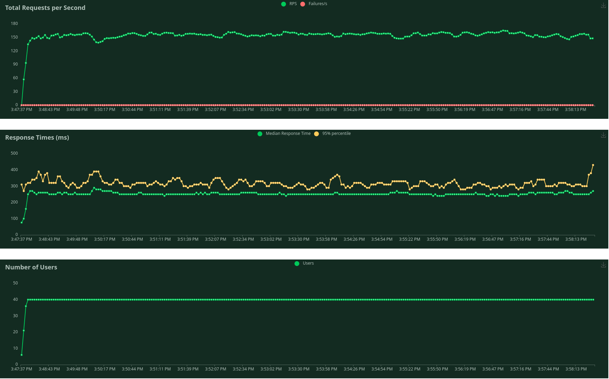

## Métriques de l'application de l'application :

Usage de la ram au repos par la base de donnée avec 1000 utilisateurs, 600 produits, 6286 variantes de produits, 1000 informations utilisateurs, 4000 adresses, : 40% 

Après quelque test de charge sur le site, on a pu déterminer que la vue qui est la plus compliquée a chargé est celle de l'affichage des produits, sans filtre, ensuite une des fonctions les plus complexes utilisées souvent est celle de l'ajout d'un produit au panier.

Ici la montée en charge pour la vue du magasin

Ici la montée en charge lorsque des utilisateurs vont sur le magasin et rajoute un produit dans leur panier.
(Run 1 : Run avec seulement 30 utilisateurs la fin, Run 2 : Run avec 1000 utilisateurs a la fin)

.png)

Les montées en charge ont été faite avec 40 et 30 users simultané, après quelque test empiriques, c’est le nombre d'utilisateurs max qui peuvent avoir une connexion simultanée avec les pleines performances, au-delà les perfomances se dégrade.
Aussi au bout de 700 users, les performances sont si dégradées que le serveur commence à timeout certains utilisateurs.
En dessous de ce nombre d’utilisateurs, les temps de réponse sont au-dessus de 1 s.

### Analyse des résultats :

Avec ces quelques tests, on peut voir que notre application est suffisement efficace avec l'infrastructure actuelle pour permettre un début d'exploitation, le site n'aurait au début que rarement plus de 30 utilisateurs simultanés et faisant les mêmes requêtes.