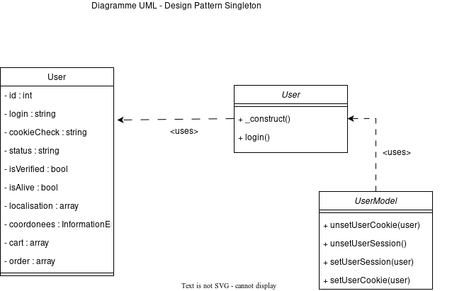

# Compte rendu de livraison de project (R3.04):

## Equipe 1-1

Ce project a été menée par:

- Titouan Gautier
- Maxime Santos Pereira
- Arthur Hamelin
- Luna Manson

Pour ce project nous avons été missioné par une entreprise pour créer un site de E-commerce, pour mettre en place tous cela nous avons utilisé différent design pattern: DAO, Singleton et Facade.

## 1 : Le design patern DAO

### Pourquoi ?:
Nous avons choisi le design pattern DAO pour pouvoir aisément importé ou exporté différentes masses données dans les différentes tables voulues. Cela permet à l'administrateur de télécharger les données en masse pour les sauvegarder, ou en importer en masse pour mettre a jour la base de donnée rapidement.

### Comment ?:
La mise en oeuvre de ce design pattern ce fait via une interface en premier lieu où l'on a définit les principales méthodes à utiliser dans les différents models DAO (dao_json, dao_csv, dao_xml, dao_yaml). Vient ensuite le controller DAO où l'on choisit le model à utiliser en fonction de l'extension donnée par l'utilisateur. Le controller gère également les requêtes d'import ou d'export des données de l'utilisateur. Pour finir les différents modeles implémentent l'interface DAO c'est à dire les méthodes addData et getData. Ces 2 méthodes utilisent des packages avec des procédures pour pouvoir communiquer avec la base de donnée, les procédures et les packages changent en fonction de la table utilisé.

### Diagramme UML:

### Diagramme mis en place:

## 2 : Le design patern Singleton

### Pourquoi ?:
Nous avons choisi d'implémenter le design pattern Singleton lors de la connexion car une variable de session se crée ainsi qu'un cookie si l'utilisateur souhaite rester connecté. Il est donc préférable d'avoir une unique variable de session ainsi qu'un unique cookie gérant ces aspects. 

### Comment ?:
Lors de la création de ces variables on vérifie si elles sont existantes, si cela est le cas on les supprimes puis on les recréent pour éviter toute duplication d'instance.

## 3 : Le design patern Facade

### Ou ?:

Dans la classe InvoicePDFModel.

### Pourquoi ?:

Car cette classe permet de simplifié l'utilisation de la classe PDFInvoice qui nous permet
de créer une facture. Pour ce faire cette classe demande juste l'id d'une commande, l'objet
utilisateurs a qui correspond cette commande, et l'objet de base de la facture. Ensuite
cette classe prend en charge de trouver la commande et de généré la facture aproprié.

On a donc bien InvoicePDF qui utilise InvoicePDFModel pour simplifié la génération des facture, InvoicePDFModel se chargant de l'utilisation de InvoicePrinter.
