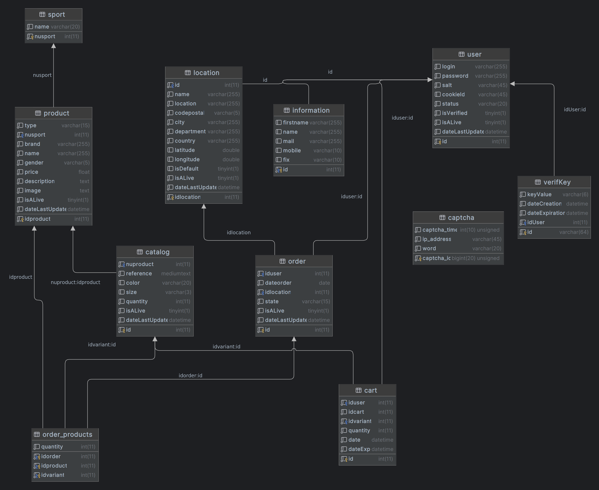

# Compte-Rendu SQL SAE3 :

## 1 - Schéma relationnel :


On voit ci-dessus les différentes tables présente dans la base de donnée : 
- <span style="color:blue"><b>Sport</b></span> qui contient les noms des 4 sports présent sur notre site (Football, Volleyball, Badminton et Arts-Martiaux), la clé primaire de cette table étant **nusport**.
- <span style="color:blue"><b>Product</b></span> qui contient les différents produits du site avec comme clé primaire **idproduct** et comme clé étrangère **nusport** qui relie à la table **Sport (nusport)**.
- <span style="color:blue"><b>Catalog</b></span> qui contient les différentes tailles, couleurs et quantités des produits, la clé primaire étant l'**id** de la variante du produit. Et la clé étrangère étant **nuproduct** liant à la table **Product (idproduct)**.
- <span style="color:blue"><b>Cart</b></span> qui contient les différents paniers enregistrer par les utilisateurs, elle a pour clé primaire **id** qui correspond à un produit présent dans un panier d'un utilisateur et a pour clé étrangère **iduser** reliant à la table **User (id)** et la clé étrangère **idvariant** reliant à la table **Catalog (id)**.
- <span style="color:blue"><b>Order</b></span> qui contient les commandes des utilisateurs, la clé primaire est **id** et les clées étrangères sont **iduser** qui relie à la table **User (id)** et **idlocation** qui relie à la table **Location (idlocation)**.
- <span style="color:blue"><b>Order_products</b></span> qui contient les produits des différentes commandes des utilisateurs. Les clées primaires sont **idorder**, **idproduct** et **idvariant**, ces clées sont également étrangères permettant d'être reliée à **Order (id)**, **Product (idproduct)** et **Catalog (id)**.
- <span style="color:blue"><b>User</b></span> qui contient les différents utilisateurs avec leurs informations de connexion. La clé primaire est **id**.
- <span style="color:blue"><b>Location</b></span> qui contient les différentes adresses de l'utilisateur. La clé primaire est **idlocation** et la clé étrangère est **id** qui relie à la table **User (id)**.
- <span style="color:blue"><b>Information</b></span> qui contient les différentes coordonnées de l'utilisateur. La clé primaire est **id**, elle est également étrangère est relie à la table **User (id)**.
- <span style="color:blue"><b>Captcha</b></span> qui regroupe les différents captcha généré lors de la création de compte. La clé primaire est **captcha_id**.
- <span style="color:blue"><b>VerifKey</b></span> qui contient les différentes clés généré lorqu'on souhaite une vérification supplémentaire par mail. La clé primaire est **id** et la clé étrangère est **idUser** reliant à la table **User (id)**.

## 2 - Contraintes :

Les contraintes suivantes ont été réaliser lors de la création des tables.

Il y a une contrainte **status_not_valid** sur la table <span style="color:blue"><b>User</b></span> pour vérifier si le Status est dans le bon format : 
``` sql
    constraint status_not_valid
        check(status in ('Administrateur','Client','Caspor')),
```

Il y a deux contraintes sur la table <span style="color:blue"><b>Product</b></span>, la première **type_not_valid** pour vérifier si le type est dans le bon format, et la deuxième **gender_not_valid** pour vérifier si le genre du produit est dans le bon format : 
``` sql
    constraint type_not_valid
        check( type in ('Vêtement','Chaussure','Equipement') ),
    constraint gender_not_valid
        check( gender in ('Homme','Femme','Mixte'))
```

Il y a une contrainte **status_not_valid** sur la table <span style="color:blue"><b>Order</b></span> pour vérifier si le Status est dans le bon format : 
```sql
    constraint status_not_valid
        check(state in ('Non preparer','En preparation','Preparer','Expedier'))
```

## 3 - Package

### Package sport

| Nom  | Paramètre entrant | Paramètres sortant | Commentaires |
| ------- | -------- | ------- | -------- |
| getNameSport   | nusport int | Nom du sport qui est associé à nusport | Permet d'avoir le nom du sport en fonction de son id |
| getIdSport | name varchar | Id du sport associé  à name | Permet d'avoir l'id du sport en fonction de son nom |
| getAll | | Toutes les lignes de la table sport | Permet de récupérer toutes les informations sur les sports |

### Package user

| Nom  | Paramètre entrant | Paramètres sortant | Commentaires |
| ------- | -------- | ------- | -------- |
| verifyLogin | loginSearch varchar |  | Permet de vérifier si un login donnée est présent dans la BD |
| verifyEmail | mailSearch | | Permet de vérifier si un mail donnée est présent dans la BD |
| verifyPhone | phone int | | Permet de vérifier si un Numéro de téléphone donnée est présent dans la BD |
| verifyId | newId int | | Permet de vérifier si un ID donnée est présent dans la BD |
| getUserByLogin | loginSearch varchar | | Permet de récupérer un user par son login |
| getUserById | idSearch varhcar |  | Permet de récupérer un user par son ID |
| getUserByEmail | mailSearch varchar |  | Permet de récupérer un user par son adresse mail |
| getPasswordById | idSearch int |  | Permet de récupérer un mot de passe par un ID |
| getStatusById | idSearch int |  | Permet de récupérer un status par un ID |
| getUserInfoById | idUser int |  | Permet de récupérer les information d'un user à partir de son id |
| getUserLocationById | idUser int |  | Permet de récupérer la Location d'un user avec son ID |
| loginMail | mail varchar |  | Permet de récupérer un mot de passe par une adresse mail |
| addUser | newid int, newlogin varchar,  newpass varchar,  newsalt varchar, newcookie varchar, newstatus varchar, newverif boolean, newalive boolean, newdate datetime | | Permet d'ajouter un user |
| addInformation | newid int,  newfirstname varchar,  newname varchar,  newmail varchar,  newmobile int,  newfix int | | Permet d'ajouter les coordonnées d'un user par son ID |
| createUser | newId int,  newLogin varchar,  newPass varchar,  newSalt varchar,  newfirstname varchar,  newname varchar,  newEmail varchar,  newMobile int,  newFix int, dateLastUpdate date | | Permet d'ajouter un user et ses coordonnées |
| delUser | iduser int | - | Permet de supprimer un user, ses coordonnées et sa location |
| setCookieId | newCookieId varchar(45),  iduser int | - | Permet d'ajouter un cookie à un user |
| delCookieId | iduser int | - | Permet de supprimer le cookie d'un user |
| updateCoordonnees | iduser int,  newfirstname varchar(255),  newname varchar(255),  newmail varchar(255),  newmobile int,  newfix int | - | Permet de mettre à jour les différentes coordonnées d'un user |
| updateLocalisation | newidlocation int, iduser int, newname varchar(255)  ,newlocation varchar(255),  newcode int,  newcity varchar(255),  newdep varchar(255),  newcountry varchar(255) | - | Permet de mettre à jour les différentes localisations d'un user |
| updateUtilisateur | iduser int,  newlogin varchar(255),  newpass varchar(255) | - | Permet de mettre à jour un user |
| updateStatus | iduser int,  newstatus varchar(20) | - | Permet de mettre à jour le status d'un user |
| getLocationById | idloc integer | - | Permet de connaitre la Location d'un user à partir de son id |
| updateLastName | targetId integer, newLastName varchar(255) | - | Permet de mettre à jour le nom de famille du User |
| updateFirstName | targetId integer, newFirstName varchar(255) | - | Permet de mettre à jour le prénom du user |
| updateEmail | targetId integer, newMail varchar(255) | - | Permet de mettre à jour l'email du user |
| updateMobile | targetId integer, newMobile varchar(255) | - | Permet de mettre à jour le numéros de téléphone portable du user |
| updateFixe | targetId integer, newFixe varchar(255) | - | Permet de mettre à jour le numéros de téléphone fixe du user |
| updatePassword | targetId integer, newPass varchar(255), newSalt varchar(45) | - | Permet de mettre à jour le password du user |
| verifySalt | newSalt varchar(255) | - | Permet de vérifier que le sel n'est pas déja présent dans la BD |
| getLocationByIdAndUserId | idUser int, idLoc int | - | Permet de trouver une location d'un user |
| isUniqueAddressName | searchName varchar(255), searchIdUser int | - | Permet de vérifier que le nom de l'adresse ne figure pas déjà dans les adresses du user |
| getAddresseById | searchId int | - | Permet de récupérer l'adresse avec l'id du user |
| verifyLocId | searchId int | - | Permet de récupérer le nom d'une location grace à son id |
| updateLocById | searchId int, newId int, idUser int, newLocName varchar(255), newLocAddress varchar(255), newLocCode int, newLocCity varchar(255), newLocDep varchar(255), newLocCountry varchar(255), newLocLat double, newLocLong double, newIsDefault bool, dateCreation date | - | Permet de mettre à jour une Location avec son id |
| addressIsDead | searchId int, newDateLastUpdate datetime | - | Permet de vérifier si une adresse est en morte |
| countAddressByIdAndName | searchId int, searchName varchar(255) | - | Permet de compter le nombre d'adresse ayant le meme nom et le meme id que celui donné en paramètre |
| createLoc | newId int, idUser int, newLocName varchar(255), newLocAddress varchar(255), newLocCode int, newLocCity varchar(255), newLocDep varchar(255), newLocCountry varchar(255), newLocLat double, newLocLong double, newIsDefault bool, dateCreation date | - | Permet de créer une Location |
| sameAddresse | searchUserId int, searchAddress varchar(255), searchCity varchar(255) | - | Permet de vérifier si deux adresses sont pareilles, renvoie le nombre d'adresses identiques |
| sameAddresseModif | searchUserId int, searchAddress varchar(255), searchCity varchar(255) | - | Permet de vérifier si deux adresses sont pareilles, renvoie le nombre d'adresses identiques et l'id |
| countAliveAddressByUserId | searchUserId int | - | Permet de compter le nombre d'adresses actives par user |
| getAllUser | - | - | Permet de récupérer tous les users |
| getAllLocation | - | - | Permet de récupérer toutes les Locations |
| getAllInformation | - | - | Permet de récupérer toutes les Informations |
| getIsVerifiedById | idSearch VARCHAR(255) | - | Permet de vérifier qu'un user est vérifié à partir de son id |
| getIsALiveById | idSearch VARCHAR(255) | - | Permet de vérifier si un user est en vie avec son id |
| getDateLastUpdateById | idSearch VARCHAR(255) | - | Permet de récupérer la date du dernier update d'un user avec son id |
| userIsDead | searchId int, newDateLastUpdate date | - | Permet de mettre un user mort avec son id |
| setUserVerified | searchId int, newDate datetime | - | Permet de vérifier un user avec son id |
| changeStatus | searchId int, newStatus varchar(255) | - | Permet de changer le status de l'user |

### Package product

| Nom | Paramètre Entrant | Paramètre Sortant | Commentaire |
| --- | ---               | ---               | ---         |
| getProductBySport | sport integer | - | Permet d'avoir les différents produits d'un sport spécifique |
| getProductByType | type varchar(15) | - | Permet d'avoir les différents produits d'un type spécifique |
| getProductByBrand | brand varchar(255) | - | Permet d'avoir les différents produits d'une marque spécifique |
| orderByPriceAsc | - | - | Permet d'avoir les différents produits trié par prix croissant |
| orderByPriceDesc | - | - | Permet d'avoir les différents produits trié par prix décroissant |
| getProductBySize | size varchar(3) | - | Permet d'avoir les différents produits d'une taille spécifique |
| getProductByColor | color varchar(20) | - | Permet d'avoir les différents produits d'une couleur spécifique |
| getProductBySportType | sport integer, type varchar(15) | - | Permet d'avoir les différents produits d'un sport et d'un type spécifique |
| getProductById | id integer | - | Permet d'avoir un product par son ID |
addProduct | newid int,  newtype varchar(15),  newnusport int,  newmarque varchar(255),  newnom varchar(255), newgenre varchar(5),  newprix float,  newdesc varchar(255),  newimage text, newIsALive boolean, newDate datetime | | Permet d'ajouter un product à la BD
updateProduct | id int, newtype varchar(15), newnusport int, newmarque varchar(255), newnom varchar(255), newgenre varchar(5), newprix float, newdesc varchar(255) | | Permet de modifier un product
updatePrice | nuproduct int,  newprice int | | Permet de mettre à jour le prix d'un product
updateDescription | nuproduct int,  newdesc varchar(255) | | Permet de mettre à jour la description d'un product
updateImage | nuproduct int,  newimage text | | Permet de mettre à jour le chemin vers l'image d'un product
delProduct | nuproduct int | | Permet de supprimer un product
getAll | | | Permet de récupérer tout les produits
getAllAsAlive | | | Permet de récupérer tout les produits en vie
getAllNotAlive | | | Permet de récupérer tout les produits qui ne sont pas en vie.
getAllBrand | | | Permet de récupérer toutes les marques
getProductByName | newname varchar(255) | | Permet de récupérer un produit selon son nom
getProductByNameWithoutSelf | newname varchar(255), id int | | Permet de récupérer un produit selon son nom sauf celui qui correspond a l'id fourni
countAll | | | Permet de compter le nombre de produit
countByTypeAndSport | newtype varchar(15), newsport  int |integer |	Permet de compter le nombre de produits par sport et par type
getProductByRangeAndSportAndType | start int, step int, sport int, newtype varchar(15) | liste de produits |	Permet d'avoir un nombre donné de produits par sport et par type, en commençant à partir de start et en prenant step produits


### Package Order

Nom | Paramètre entrant | Paramètre sortant | Commentaire
--- | --- | --- | ---
getOrderUserById | nuorder int, newiduser int |  | Permet d'avoir une commande par son ID pour un client donné
getOrderUser | iduser int |  | Permet d'avoir les commandes d'un client
addOrder | newid int, newiduser int, newdateorder datetime, newidlocation int, newstate varchar(15), newisalive bool, newdatelastupdate datetime |  | Permet d'ajouter une commande à un client
addProductToOrder | newidorder int, newidproduct int, newidvariant int, newquantity int |  | Permet d'ajouter un produit à une commande
updateState | nuorder int, newstate varchar(15) |  | Permet de mettre à jour l'état d'une commande
updateLocationOrder | nuorder int, newlocation varchar(15) |  | Permet de mettre à jour l'adresse d'une commande
getAll |  |  | Permet de récupérer toutes les commandes
verifyId | newid int |  | Permet de vérifier que l'ID n'est pas déjà présent dans la base de données
delOrder | newidorder int |  | Permet de supprimer une commande
getOrderProduct | id int |  | Permet de récupérer tous les produits d'une commande
getOrderById | newid int |  | Permet de récupérer une commande à partir de son ID
getAllProduct |  |  | Permet de récupérer tous les produits de toutes les commandes

### Package Catalog

Nom | Paramètre entrant | Paramètre sortant | Commentaire
--- | --- | --- | ---
getStock | id integer |  | Permet d'avoir le stock d'un produit par son ID, donc toutes les variantes existantes
getStockTotal | id integer |  | Permet d'avoir le nombre total en stock d'un produit
getStockByVariant | newidvariant int |  | Permet d'avoir le stock d'une variante d'un produit
addCatalog | newid int, newproduit int, newreference long, newcouleur varchar(20), newtaille varchar(3), newquantite int, newIsALive bool, newDate datetime |  | Permet d'ajouter au Catalogue un nouveau produit ou variante d'un produit
delVariante | idvariante int |  | Permet de supprimer une variante
updateQuantity | idvariante int, newquantity int |  | Permet de mettre à jour la quantité d'une variante donnée
updateALive | idvariante int, newstate bool |  | Permet de mettre un variant de produit alive avec son id
getAll |  |  | Permet de récupérer toutes les variantes de produits
getCatalogByVariant | newidvariant int |  | Permet de récupérer une variante à partir de son catalogue
getAllByNuProduct | newNuProduct int |  | Permet de récupérer toutes les variantes d'un produit à partir de son numéro
getCatalogById | newid int |  | Permet de récupérer une variante à partir de son catalogue
updateCatalogQuantite | newid int, newquantite int |  | Permet de mettre à jour la quantité d'une variante dans le catalogue
deleteCatalog | newid int |  | Permet de supprimer une variante dans le catalogue
heHaveCatalog | newnuproduct int, newColor varchar(20), newSize varchar(3) |  | Permet de savoir si une variante existe avec se numéro, cette couleur et cette taille

### Package Captcha

Nom | Paramètre entrant | Paramètre sortant | Commentaire
--- | --- | --- | ---
countWordCapchat | newWord varchar(20), ipAddress varchar(45), expiration int |  | Permet d'avoir le nombre de Captcha actif pour une adresse donnée
addCaptchat | captchaTime int, ipAddress varchar(45), newWord varchar(20) |  | Permet d'ajouter un Captcha à la base de données
cleanCaptchat | expiration int |  | Permet de supprimer un Captcha en fonction de sa durée de vie


### Package VerifKey

Nom | Paramètre entrant | Paramètre sortant | Commentaire
--- | --- | --- | ---
verifyId | id varchar(54) |  | Permet de vérifier si l'ID est valide 
verifyKey | newKey varchar(6) |  | Permet de vérifier si la clé est valide
createKey | newId varchar(54), newKey varchar(6), newDateCreation datetime, newDateExpiration datetime, newIdUser int |  | Permet de créer une clé
allIdKey |  |  | Permet de récupérer toutes les clés
deleteKey | searchId varchar(54) |  | Permet de supprimer une clé
checkCode | newId varchar(54), newKey varchar(6) | | Permet de vérifier si le code est valide
getIdByIdKey | newId varchar(6) |  | Permet de récupérer l'ID à partir d'une clé


### Package Cart

Nom | Paramètre entrant | Paramètre sortant | Commentaire
--- | --- | --- | ---
getCart |  |  | Permet de récupérer tous les paniers
addCart | newid int, newiduser int, newidcart int, newidvariant int, newquantity int, newdate datetime, newdatexp datetime |  | Permet d'enregistrer un panier
verifyId | id int |  | Permet de vérifier si l'ID n'est pas déjà présent dans la base
getCartById | newid int |  | Permet de récupérer un panier avec son ID
maxIdCart | newid int |  | Permet de récupérer l'ID du panier le plus grand d'un utilisateur
modifyQuantity | newquantity int, user int, cart int, variant int |  | Permet de modifier la quantité d'un panier
deleteCart | newidcart int, newiduser int |  | Permet de supprimer un panier
deleteProductDB | newiduser int, newid int |  | Permet de supprimer un produit d'un panier
getCartIdcart | newiduser int ,newidcart int |  | Permet de récupérer un panier avec son ID
